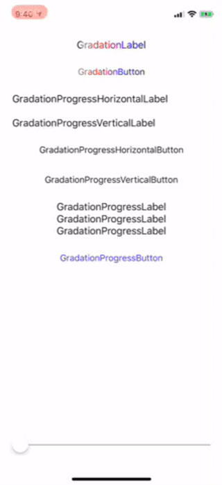
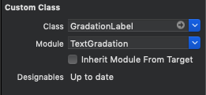
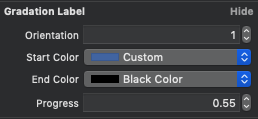
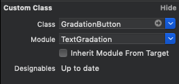
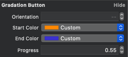

# TextGradation

[](http://cocoapods.org/pods/Tags)
[](http://cocoapods.org/pods/Tags)
[](http://cocoapods.org/pods/Tags)
[](https://developer.apple.com/swift/)

## Introduce

You can add a gradient to the text of a UILabel or UIButton.




## Requirements

`TextGradation` written in Swift 4.2. Compatible with iOS 8.0+

## Installation

TextGradation is available through [CocoaPods](https://cocoapods.org). To install
it, simply add the following line to your Podfile:

```ruby
pod 'TextGradation'
```

### Xib or Storyboard file

GradationLabel





GradationButton






<br><br><br>

### Code Editor

```swift
import TextGradation
```

```swift

gradationLabel.gradation(.horizontal, colors: [UIColor.gray, UIColor.red, UIColor.blue, UIColor.black])

gradationButton.gradation(.horizontal, colors: [UIColor.gray, UIColor.red, UIColor.blue, UIColor.black])

```

progress

```swift

gradationProgressHorizontalLabel.gradation(.horizontal, startColor: UIColor(red: 106/255, green: 183/255, blue: 216/255, alpha: 1), endColor: .black, progress: CGFloat(sender.value))

gradationProgressVerticalLabel.gradation(.vertical, startColor: UIColor(red: 106/255, green: 183/255, blue: 216/255, alpha: 1), endColor: .black, progress: CGFloat(sender.value))

gradationProgressHorizontalButton.gradation(.horizontal, startColor: UIColor(red: 106/255, green: 183/255, blue: 216/255, alpha: 1), endColor: .black, progress: CGFloat(sender.value))

gradationProgressVerticalButton.gradation(.vertical, startColor: UIColor(red: 106/255, green: 183/255, blue: 216/255, alpha: 1), endColor: .black, progress: CGFloat(sender.value))

```


## Author

pikachu987, pikachu77769@gmail.com

## License

TextGradation is available under the MIT license. See the LICENSE file for more info.
